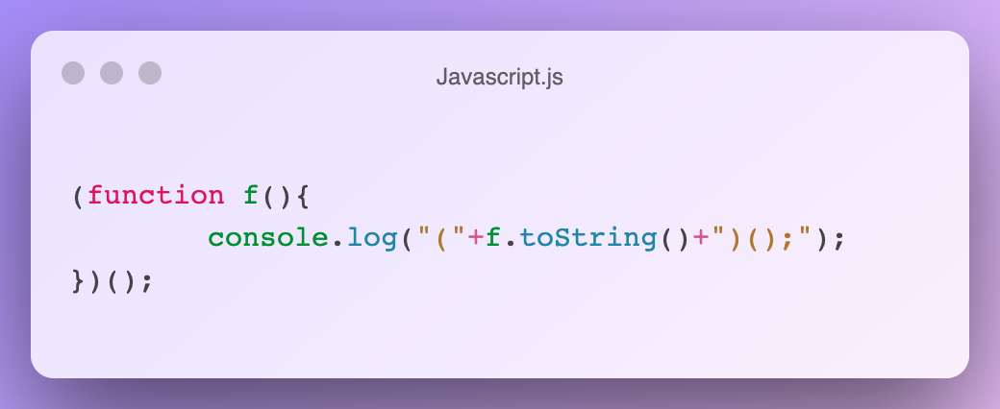

 

This repo is a collection of quines in all programming languages.

A quine in computer science is a program which takes no input and produces a copy of its source code as its only output.

## Example

## Contributing
Everyone is welcome to contribute to this repo - read the contribution guidelines to find out how.
